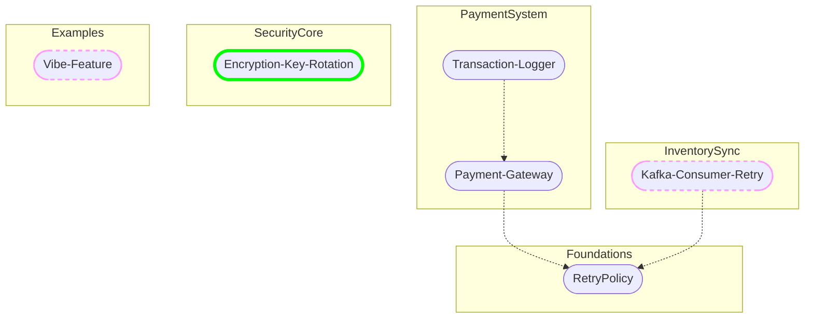

# 🕸️ System Dependency Graph

> Auto-generated by Librarian.

```mermaid
graph TD
    subgraph Foundations [Foundations]
        Foundations_RetryPolicy([RetryPolicy])
    end
    subgraph PaymentSystem [PaymentSystem]
        PaymentSystem_Payment_Gateway([Payment-Gateway])
        PaymentSystem_Transaction_Logger([Transaction-Logger])
    end
    subgraph SecurityCore [SecurityCore]
        SecurityCore_Encryption_Key_Rotation([Encryption-Key-Rotation]):::secured
    end
    subgraph Examples [Examples]
        Examples_Vibe_Feature([Vibe-Feature]):::proposed
    end
    subgraph InventorySync [InventorySync]
        InventorySync_Kafka_Consumer_Retry([Kafka-Consumer-Retry]):::proposed
    end
    PaymentSystem_Payment_Gateway -.-> Foundations_RetryPolicy
    PaymentSystem_Transaction_Logger -.-> PaymentSystem_Payment_Gateway
    InventorySync_Kafka_Consumer_Retry -.-> Foundations_RetryPolicy

    classDef proposed stroke:#f9f,stroke-width:2px,stroke-dasharray: 5 5;
    classDef secured stroke:#0f0,stroke-width:4px;
```